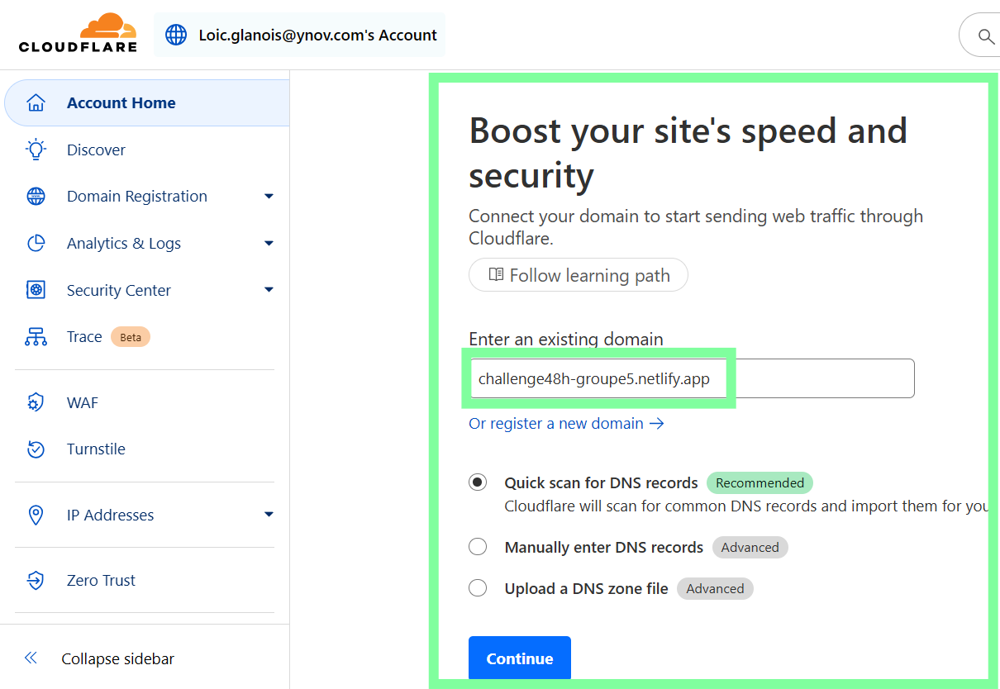
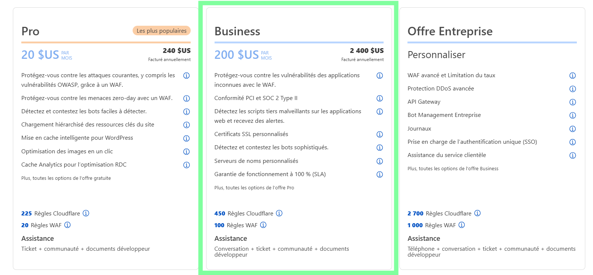

# Mise en place du reverse-proxy CDN Cloudflare 

## Prérequis
- Un serveur Debian hébergeant Apache
- Un nom de domaine
- Un accès au panneau DNS de Cloudflare

---

## 1. Création du compte et ajout du domaine

1. Créer un compte Cloudflare : https://dash.cloudflare.com/
2. Ajouter votre nom de domaine dans l’interface Cloudflare  
   
3. Choisir un plan adapté (Gratuit pour la mise en place)
   
4. Cloudflare génère des serveurs de noms (nameservers) à configurer dans le bureau d'enregistrement du domaine.
5. Mettre à jour les serveurs DNS pour ceux fournis par Cloudflare

---

## 2. 🔁 Configuration DNS sur Cloudflare

1. Dans le tableau de bord Cloudflare, aller dans l'onglet "DNS"
2. Ajouter les enregistrements suivants :
   - Type : A  
     Nom : @  
     Contenu : IP publique de votre serveur Debian  
     Proxy status : Activé (icône nuage orange)
   - Type : A  
     Nom : www  
     Contenu : IP publique de votre serveur Debian  
     Proxy status : Activé

   Exemple :

   | Type | Nom  | Contenu        | Proxy Status |
   |------|------|----------------|---------------|
   | A    | @    | 203.0.113.10   | 🟠 Activé      |
   | A    | www  | 203.0.113.10   | 🟠 Activé      |

---

## 3. 🔐 Configuration HTTPS

### a. Choix du mode SSL/TLS dans Cloudflare

Aller dans l’onglet "SSL/TLS" de Cloudflare, puis choisir le mode :

- Recommandé : Full (strict) — nécessite un certificat SSL valide côté serveur (Let’s Encrypt par exemple)

### b. Certificat SSL sur le serveur Apache

Installer un certificat Let’s Encrypt via Certbot :

```bash
sudo apt install certbot python3-certbot-apache
sudo certbot --apache
```